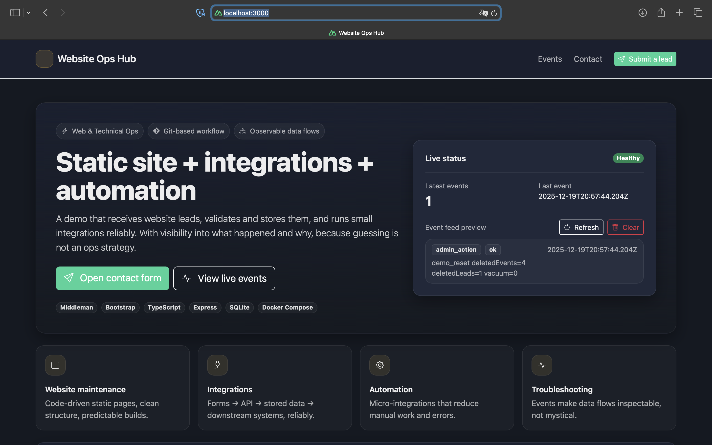
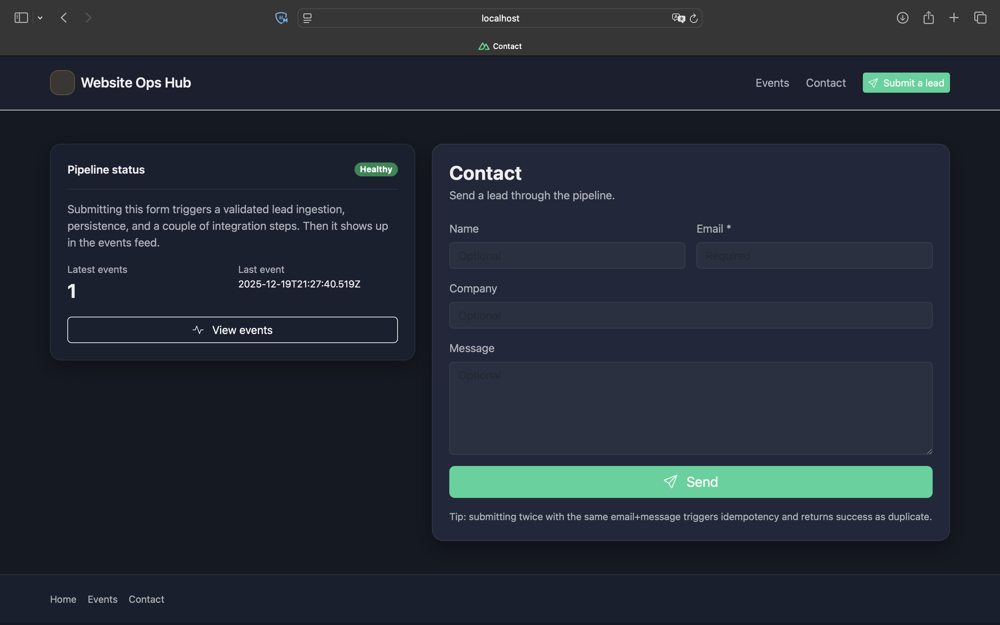
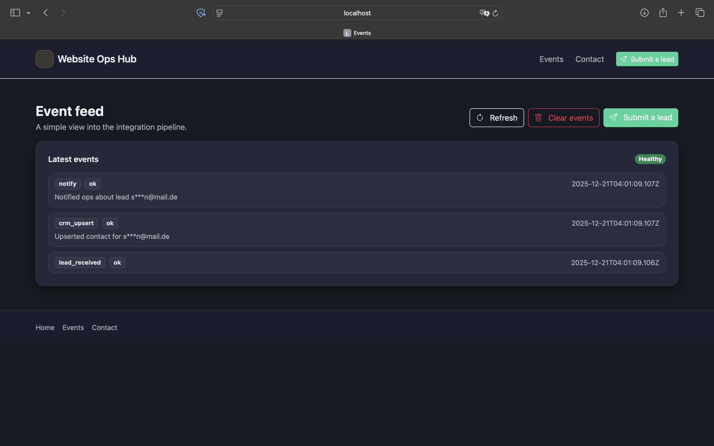

# Website Ops Hub
A tiny Web & Technical Ops demo: a static site (Middleman) submits leads to an API
(Express + SQLite), which records an event trail so you can inspect what happened
and why.


---
## What this demonstrates
- Static site + API integration via form submission
- Validation + persistence using SQLite (Docker volume)
- Simple observability via an event feed
- Clear separation between demo mode and dev mode
- Docker Compose–based local setup
---

## Intended audience

This project is designed for:
- technical operations / platform engineers
- full-stack developers
- interview demos and technical take-home reviews

It focuses on **clarity, observability, and correctness**, not feature completeness.

---

## Quick Start (Prebuilt Demo – Recommended)

This project runs entirely via Docker Compose using **prebuilt images**.
No local builds required.

### Clone the repo and start the system
```bash
git clone https://github.com/Punschkrapferl/website-ops-hub.git
cd website-ops-hub
cp .env.example .env
```

Edit ```.env``` (minimum recommended):
```dotenv
ADMIN_TOKEN=changeme
CORS_ORIGIN=http://localhost:4567
DB_PATH=/data/app.db
```

Notes:
- `ADMIN_TOKEN` is required for admin/destructive endpoints (reset, clear events).
- `CORS_ORIGIN` is only needed for dev mode (Middleman on `:4567` calling API on `:8080`).
- `DB_PATH` defaults to `/data/app.db` in the API container.

---

# Run modes
## Demo mode (nginx, same-origin, no CORS)
- Static site served by nginx
- API requests proxied through nginx under `/api/*`
- Browser uses same-origin calls (no CORS required)

Ports:
- Site: `http://localhost:3000`
- API health (direct): `http://localhost:8080/health`

Run:
```bash
docker compose -f docker-compose.demo.yml up --build
```

Stop:
```bash
docker compose -f docker-compose.demo.yml down
```

---

## Dev mode (Middleman hot reload)
- Middleman dev server with hot reload
- Browser calls API directly
- API must allow CORS (`CORS_ORIGIN`)

Ports:
- Site: `http://localhost:4567`
- API health (direct): `http://localhost:8080`

Run:
```bash
docker compose --profile dev up --build
```

Stop:
``` 
docker compose --profile dev down
```
---

## Architecture (high level)
```
┌──────────────────────────────┐
│        Static Website        │
│   Middleman (build output)   │
│          served by           │
│            nginx             │
│   http://localhost:3000      │
│   (or :4567 in dev mode)     │
└──────────────┬───────────────┘
               │
               │ POST /api/lead
               │ (form submission)
               ▼
┌──────────────────────────────┐
│        Express API           │
│     http://localhost:8080    │
│                              │
│ - Input validation (Zod)     │
│ - Idempotency handling       │
│ - Transactional writes       │
│ - Event emission             │
└──────────────┬───────────────┘
               │
               │ inserts / reads
               ▼
┌──────────────────────────────┐
│           SQLite             │
│      (Docker volume)         │
│                              │
│ - leads table                │
│ - events table               │
│ - WAL mode enabled           │
└──────────────┬───────────────┘
               │
               │ queried by API
               ▼
┌──────────────────────────────┐
│        Events Feed UI        │
│                              │
│ Shows step-by-step trace:    │
│ - lead_received              │
│ - crm_upsert (mock)          │
│ - notify (mock)              │
└──────────────────────────────┘

```

---

## Lead submission (Contact form)

The contact form is the entry point into the pipeline.  
Submitting the form triggers validation, persistence, and downstream events.



---
## Event model
For each lead submission, the API emits a sequence of events:
- `lead_received` – request accepted and validated
- `crm_upsert` – mock downstream CRM integration
- `notify` – mock operations notification
  events are intentionally separate so partial failures are visible in the UI.



---

## API endpoints
### Health
```http
GET /health
```
Returns `200 OK` if the API is running.

---

### Lead ingestion
```http
POST /api/lead
```
- Validates input
- Stores lead in SQLite
- Emits events
- Triggers mock integrations
- Supports idempotency via `Idempotency-Key` header

---

### Events feed
```http
GET /api/events
DELETE /api/events
```
Admin header required for destructive actions:
```http
X-Admin-Token: <ADMIN_TOKEN>
```
Example:
```bash 
curl -X DELETE http://localhost:8080/api/events \
  -H "X-Admin-Token: changeme"
```

---

### Admin reset
```http
POST /api/admin/reset
```
Optional query:
```http
?vacuum=1
```
Example:
```bash
curl -X POST "http://localhost:8080/api/admin/reset?vacuum=1" \
  -H "X-Admin-Token: changeme"
```

---

## Admin authentication
Admin endpoints require a shared secret:
```http
X-Admin-Token: <ADMIN_TOKEN>
```
If `ADMIN_TOKEN` is not configured, the API fails fast on startup.

---

## Security notes (demo scope)

- Admin actions are protected by a shared token embedded at build time
- Tokens are for local demo use only
- No secrets should be committed to the repository
- No user authentication is implemented

This setup is intentionally minimal and not intended for public deployment.

---

## Persistence
- SQLite database stored on a Docker volume under `/data`
- WAL mode enabled for better concurrency
- Data survives container restarts

---

## Observability
Every significant step emits an event.
The UI displays the event feed as a trace so you can see:
- what succeeded
- what failed
- where the pipeline stopped

---

## Project structure (top level only)
```
website-ops-hub/
├── api/                # Express API + SQLite
├── site/               # Middleman static site
├── docker-compose.yml
├── docker-compose.demo.yml
├── .env.example
└── README.md
```

---

## Troubleshooting
- **CORS errors in dev mode**
  - Ensure `CORS_ORIGIN` includes `http://localhost:4567`
  - Restart: ```docker compose --profile dev up --build``` 
- **404 on `/api/*` in demo mode**
  - Check nginx proxy config and trailing slashes in `site/nginx.conf`
  - Restart: ```docker compose -f docker-compose.demo.yml up --build```
- **API not starting / DB errors**
  - Ensure `/data` volume is writable (entrypoint fixes perms)
  - Ensure `DB_PATH=/data/app.db` (or leave default)
  - Ensure `ADMIN_TOKEN` is set

---

## License
MIT